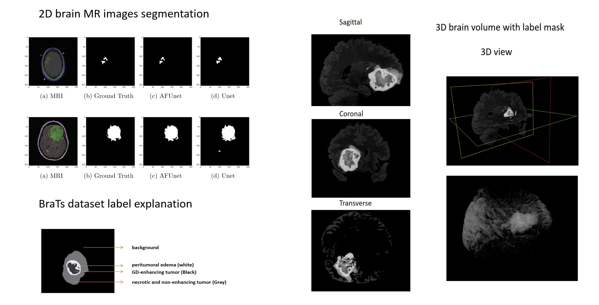

# DL AFUnet 3D BrainSeg
Attention-based Fractal Unet (AFUnet) for brain tumor segmentation using 2D neuroimaging and 3D volumetric brain data

# Table of Contents
- [Overview](#Overview)
- [Code](#Code)
- [Members](#Members)
- [Acknowledgments](#Acknowledgments)

# Overview
The proposed Attention-based Fractal Unet (AFUnet) combines the ideas of the fractal convolutional network, attention blocks, and autoencoding-decoding Unet sturctures.

## Methodology

## Dataset
The dataset we used for 2D segmentation is the [The Cancer Genome Atlas Low-Grade Glioma (TCGA-LGG) dataset](https://wiki.cancerimagingarchive.net/pages/viewpage.action?pageId=5309188), which contains 3929 three-channel RGB brain MR images and the corresponding 0-1 tumor mask indicating the regions of abnormalities (label 1's). 

The dataset we used for the 3D task is the [BRATS-2021 brain image dataset](http://braintumorsegmentation.org/). The dataset consists of 1250 3D volumes with each in the size of $4 \times 240 \times 240 \times 155$. Each sample is composed of four modalities of brain MRI scans, namely native T1-weighted (T1), post-contrast T1-weighted (T1ce), T2-weighted (T2) and Fluid Attenuated Inversion Recovery (FLAIR). The labels contain 4 classes: background (label 0), necrotic and non-enhancing tumor (label 1), peritumoral edema (label 2) and GD-enhancing tumor (label 4).

# Code

# Members

# Acknowledgments
